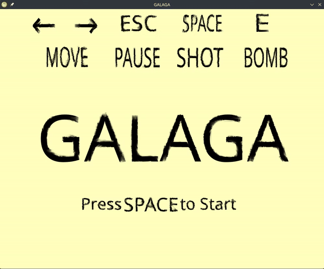

# Galaga-game

<p align="center">
  
</p>

## Описание
Данный проект реализует ретро-аркаду 1981 года **"Galaga"**. 

**Реализованный функционал:**
- Плавное передвижение объектов (корабля игрока, противников и метеоритов)
- Подсчёт уничтоженных кораблей противника и точности стрельбы игрока
- Экраны начала игры (Главное меню), победы и поражения (Game Over)

### Используемые технологии
- [**C++20**](https://cppreference.com) — современный стандарт языка
- [**SDL3**](https://github.com/libsdl-org/SDL) — библиотека для работы с графикой, вводом и звуком
- [**CMake**](https://cmake.org) & [**Ninja**](https://ninja-build.org) — автоматизированная и быстрая система сборки
- [**Git**](https://git-scm.com) — система контроля версий

---

## Установка и сборка

### 1. Клонирование репозитория
```bash
git clone https://github.com/ArtemSerock/Galaga-game
cd Galaga-game
```

### 2. Сборка (Linux)
Перед сборкой убедитесь, что в системе установлены зависимости для SDL3 и сборщик Ninja. Для Ubuntu/Debian:
```bash
sudo apt update && sudo apt install libsdl3-dev ninja-build cmake g++ -y
```

Запуск конфигурации и компиляции:
```bash
mkdir build
cmake -S . -B build -DCMAKE_EXPORT_COMPILE_COMMANDS=ON -G Ninja -DCMAKE_BUILD_TYPE=Release
cd build
ninja run
```


---

## Управление
- **Стрелка Влево / Вправо** — передвижение истребителя
- **Пробел** — Старт игры / стрельба
- **Esc** — Пауза
- **E** -- Активация спец-способности

---

## Структура проекта
```text
├── assets/      # Спрайты, звуковые эффекты и шрифты
├── include/     # Заголовочные файлы (.h / .hpp)
├── src/         # Исходный код (.cpp)
└── CMakeLists.txt
```

---

## Архитектурные решения и технические особенности

Проект спроектирован с упором на современные стандарты C++ и принципы модульной разработки:
- **Разделение логики и представления:** Игровые сущности (`Player`, `Enemy`, `Projectile`) инкапсулируют физику движения и состояния, будучи изолированными от прямого вызова графического API SDL3.
- **Игровой цикл (Game Loop):** Реализована обработка кадра с учетом `deltaTime` для обеспечения независимости скорости игры от частоты обновления монитора (фиксированный шаг физики).
- **Менеджмент ресурсов:** Загрузка текстур, шрифтов и аудиофайлов централизована через паттерн Resource Manager, что предотвращает утечки памяти и повторное чтение данных с диска.
- **Оптимизация коллизий:** Для просчета столкновений кораблей и снарядов используется алгоритм AABB (Axis-Aligned Bounding Box), обеспечивающий максимальную производительность.

