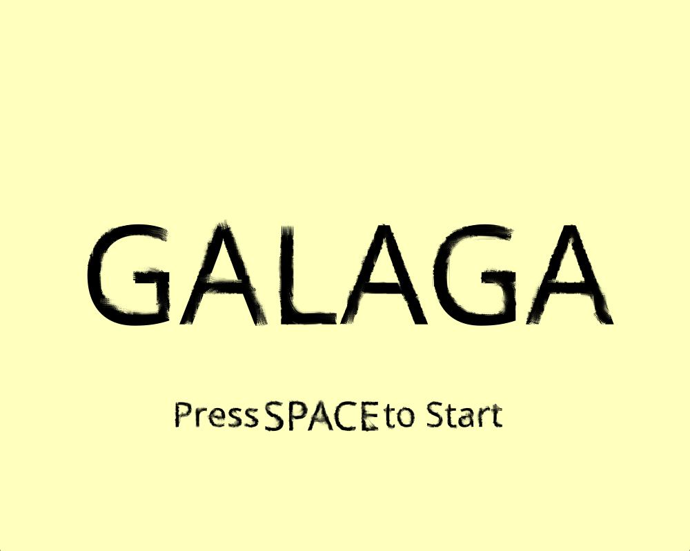

# Galaga-game



## Описание
Данный проект реализует ретро-игру 1981 года **"Galaga"**. Проект должен поддерживать:

- Передвижение объектов (корабля игрока, противников и метеоритов)
- Подсчёт уничтоженных кораблей противника, точность игрока
- Окна начала игры, победы и поражения

### Используемые технологии

В проекте используются следующие технологии и инструменты:
- [**SDL3**](https://github.com/libsdl-org/SDL) - библиотека для работы с графикой и звуком
- [**Git**](https://git-scm.com) - система контроля версий
- [**CMake**](https://cmake.org) - автоматизированная система сборки из исходного кода


## Установка
### Клонирование репозитория
```bash
git clone https://github.com/ArtemSerock/Galaga-game
cd Galaga-game
```
### Linux
```bash
mkdir build
cmake -S . -B build -DCMAKE_EXPORT_COMPILE_COMMANDS=ON -G Ninja -DCMAKE_BUILD_TYPE=Release
cd build
ninja
```

### Запуск
```bash
./Galaga
```


## Структура проекта
- /src -- исходный код (.cpp)
- /include -- заголовочные файлы (.h)
- /assets -- спрайты, звук и шрифты

## Управление
- Стрелка Влево/Вправо -- передвижение истребителя
- Пробел -- стрельба
- Enter -- старт игры / пауза
- Esc -- выход


## Архитектурные решения и технические особенности

Проект спроектирован с упором на современные стандарты C++ и принципы модульной разработки:
- **Разделение логики и представления:** Игровые сущности (Игрок, Враги, Снаряды) инкапсулируют физику движения и состояния, будучи изолированными от прямого вызова графического API SDL3.
- **Игровой цикл (Game Loop):** Реализована обработка кадра с учетом `deltaTime` для обеспечения независимости скорости игры от частоты обновления монитора (FPS).
- **Менеджмент ресурсов:** Загрузка текстур, шрифтов и аудиофайлов централизована, предотвращая утечки памяти и повторное чтение данных с диска.
- **Оптимизация коллизий:** Для просчета столкновений кораблей и снарядов используется алгоритм AABB (Axis-Aligned Bounding Box), обеспечивающий высокую производительность.
